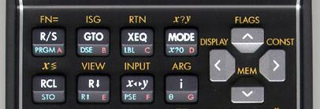

Algorithmus zum Berechnen einer Quadratwurzel
#############################################
:date: 2014-06-21 10:47
:author: marco.bakera
:tags: Mathe, Programmierung
:tags: HP35s, Taschenrechner
:slug: algorithmus-zum-berechnen-einer-quadratwurzel
:status: published

 

|(cc) Stefan Vorkoetter| 

(cc) Stefan Vorkoetter

Der Taschenrechner `HP
35s <http://www.bakera.de/dokuwiki/doku.php/schule/hp_35s>`__ hat
natürlich eine Taste zum Berechnen der Wurzel. Aber wir wollen mal
schauen, ob wir die Wurzel nicht auch selbst programmieren können. Dazu
gibt es einen einfachen Algorithmus, der mit einer Schätzung g (=guess)
beginnt und diese immer weiter verfeinert. Für die Wurzel aus der Zahl w
funktioniert der Algorithmus wie folgt.

::

    g = w + 1
    while abs(w - g*g) > 0.00001:
      g = (g + w/g) / 2
      print(g)

Mit 0.00001 geben wir die Genauigkeit an, die wir von unserer Schätzung
erwarten. Für den HP 35s sieht das Programm folgendermaßen aus.

::

     W001 LBL W
     W002 STO W
     W003 W+1
     W004 STO W
     W005 (G+W÷G)÷2
     W006 STO G
     W007 0.00001
     W008 ABS(G^2-W)
     W009 x>y?
     W010 GTO W005
     W011 RCL G
     W012 RTN

