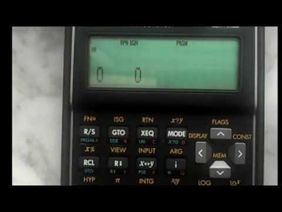

Animationen auf dem HP 35s
##########################
:date: 2014-06-20 12:49
:author: marco.bakera
:tags: Mathe, Programmierung, Video, HP35s, Taschenrechner
:slug: animationen-auf-dem-hp35s
:status: published

|image0|

Mit etwas Fingerspitzengefühl lassen sich dem `HP
35s <http://www.bakera.de/dokuwiki/doku.php/schule/hp_35s>`__ einfache
Animationen entlocken. Dafür nutzt man die `Möglichkeit, beliebige
Zeichenketten
anzuzeigen <{filename}hallo-welt-hp35s.rst>`__. Den
Quelltext und auch das laufende Programm könnt ihr im Video sehen.

.. |image0| image:: http://www.bakera.de/dokuwiki/lib/exe/fetch.php/schule/hp35sanimation.gif
   :class: media
   :target: http://www.bakera.de/dokuwiki/lib/exe/detail.php/schule/hp35sanimation.gif?id=schule%3Ahp_35s

