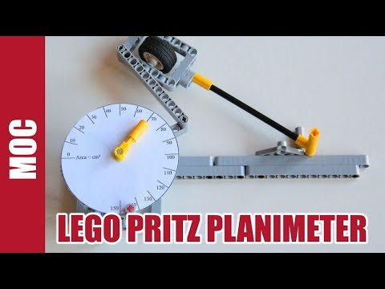

Bastelprojekt: Ein Planimeter für die Integralrechnung
######################################################
:date: 2014-06-08 07:21
:author: marco.bakera
:tags: Mathe
:tags: Integralrechnung, Lego
:slug: bastelprojekt-ein-planimeter-fuer-die-integralrechnung
:status: published

Ein `Planimeter <https://de.wikipedia.org/wiki/Planimeter>`__ ist ein
Instrument, mit dem sich der Flächeninhalt einer beliebigen Fläche
bestimmen lässt. Es handelt sich um eine Apparatur, die man früher
benutzt hat, um z.B. die Flächen von Ländern auf Karten zu bestimmen. Es
addiert die Winkel beim Umfahren auf und die Differenz aus dem Winkel
beim Start und beim Ende des Umfahrens ist proportional zum
Flächeninhalt der umfahrenen Fläche. \ `Nicolas Lespour stellt das
Prinzip in einem Blogartikel
vor <http://www.nico71.fr/pritz-hatchet-planimeter/comment-page-1/>`__
und erklärt mit einer Bauanleitung, wie du dir ein eigenes Planimeter
mit Lego-Technik basteln kannst.

Ein tolles Projekt für den Mathematikunterricht, wenn die
Integralrechnung thematisiert wird.

