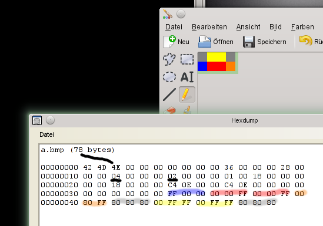

Bildanalyse: Ein tiefer Einblick in das Windows Bitmap Bildformat BMP
#####################################################################
:date: 2014-12-20 14:27
:author: marco.bakera
:tags: Informatik, BMP, HEX
:slug: bildanalyse-ein-tiefer-einblick-in-das-windows-bitmap-bildformat-bmp
:status: published

Auf der Suche nach einem Binärformat, das ich leicht analysieren und
verstehen kann, bin ich bei dem
`Bitmap-Bildformat <https://de.wikipedia.org/wiki/Windows_Bitmap>`__ von
Windows gelandet. Wie ist ein solches Bild eigentlich aufgebaut? Ich
wollte es genauer wissen und habe mir das Format daher im Detail
angeschaut.

Fangen wir mit einem Testbild aus 3x2 Pixeln an. Zum Nachmachen, könnt
ihr es z.B. mit Paint recht einfach nachmalen und mit einem Hexeditor
anschauen. Unter Linux reichen der `Midnight
Commander <https://de.wikipedia.org/wiki/Midnight_Commander>`__ oder
hexdump für solche Zwecke, unter Windows gibt es das Programm
`HxD <http://mh-nexus.de/de/hxd/>`__. Es ist auch eine schöne Übung,
dafür ein eigenes Programm in der präferierten Programmiersprache
einfach selbst zu schreiben.

|Pixelbild|

Wir betrachten das obige Bild nun Byte für Byte in der Ausgabe des
Hexeditors und fokussieren uns zunächst auf die fett markierten Zahlen.

::

     42 4d 4e 00 00 00 00 00 00 00 36 00 00 00 28 00
     00 00 03 00 00 00 02 00 00 00 01 00 18 00 00 00
     00 00 18 00 00 00 c4 0e 00 00 c4 0e 00 00 00 00
     00 00 00 00 00 00 24 1c ed ff ff ff 00 00 00 00
     00 00 ff ff ff 7f 7f 7f ff ff ff 00 00 00      

Die ersten beiden Bytes mit dem Inhalt 0x42 und 0x4d stehen für die
Buchstaben B und M als ASCII-Wert - also Bitmap. Durch das voran
gestellte "0x" wird jeweils kenntlich gemacht, das der
`Hexwert <https://de.wikipedia.org/wiki/Hexadezimalsystem>`__ 42 gemeint
ist und nicht die dezimale Zahl 42. Danach folgt ein Byte (0x4e),
welches die Größe (hier dezimal 78) in Bytes angibt. Bei dem zehnten
Byte, also an Stelle 0x0a, steht eine 0x36, die den Offset bis zum
Beginn der eigentlichen Bilddaten angibt. Die Zahlen sind jeweils fett
markiert.

Ab diesem Byte 0x36 folgen die Bilddaten. Hierbei sind pro Pixel drei
Byte abgelegt - für jede Farbe Rot, Grün und Blau ein Byte. Die Daten
sind im
`Little-Endian-Format <https://de.wikipedia.org/wiki/Byte-Reihenfolge#Little-Endian-Format>`__
abgelegt, was bedeutet, dass erst die niederwertigen Bytes kommen und
anschließend die höherwertigen Bytes folgen - also quasi genau "falsch
herum". Daher werden auch die Werte nicht als RGB-, sondern als
BGR-Werte gespeichert.

Auf dem folgenden Bild sind die Zusammenhänge noch einmal für ein
anderes Bild zusammengefasst. Ich habe diesmal ein Bild mit einer
Auflösung von 4x2 Pixeln gewählt, da die Bildzeilen im Bitmap-Format
immer mit Nullen aufgefüllt werden, bis sie ein Vielfaches von 4
ergeben. Dadurch sind bei dieser Auflösung keine "sinnlosen"
Informationen mehr im Bild enthalten.

|Zusammenhang_Bitmap_Bild|

In dem Hexdump sind die Stellen, die Farbinformationen enthalten, in der
entsprechenden Farbe hervorgehoben. Man kann gut erkennen, wie die
Zeilen von unten nach oben und von links nach rechts aufgebaut werden.

Im dritten Byte finden wir wieder die Bildgröße - in diesem Fall den
Wert 0x4E, was wieder einer dezimalen 78 entspricht. Die Auflösung
finden wir in den unterstrichenen Bytes an den Stellen 0x12 (der Wert
0x4) und 0x16 (der Wert 0x2).

Es wäre nun ein Leichtes, die Bildinformationen einzelner Pixel zu
ändern oder geheime Botschaften in der Bilddatei zu verstecken - wie in
einem
`Steganogramm <https://de.wikipedia.org/wiki/Computergest%C3%BCtzte_Steganographie>`__.
Das Team von `Hak5 <https://hak5.org/>`__ hat einen solchen Hack `schon
einmal vorgestellt <http://youtu.be/Nwc2g4eGvTs?t=6m27s>`__.

