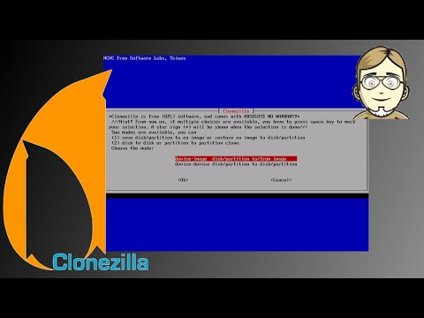

Clonezilla - Image erstellen (2/3)
##################################
:date: 2014-09-18 17:27
:author: marco.bakera
:tags: Bildung, Linux, Video, Clonezilla
:slug: clonezilla-image-erstellen-23
:status: published

`Clonezilla <http://clonezilla.org/>`__ ist eine Linuxdistribution, die
beim Klonen mehrerer Rechner hilft. Sie kommt daher besonders in
Rechnerräumen von Schulen und Universitäten zum Einsatz. Im 
`ersten Video <{filename}clonezilla-installation-und-start-13.rst>`_
haben wir Clonezilla heruntergeladen und gestartet.

Im zweiten Teil erstellen wir das Image der FreeDos-Installation und
bereiten damit den letzten Schritt vor, in dem das Image auf viele
Rechner ausgespielt werden kann.

