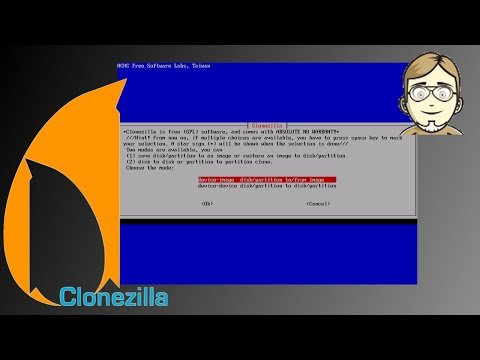

Clonezilla - Image verteilen (3/3)
##################################
:date: 2014-09-20 12:00
:author: marco.bakera
:tags: Bildung, Linux, Video, Clonezilla
:slug: clonezilla-image-verteilen-33
:status: published

`Clonezilla <http://clonezilla.org/>`__ ist eine Linuxdistribution, die
beim Klonen mehrer Rechner hilft. Sie kommt daher besonders in
Rechnerräumen von Schulen und Universitäten zum Einsatz. Im
`ersten <{filename}clonezilla-installation-und-start-13.rst>`__
und
`zweiten <{filename}clonezilla-image-erstellen-23.rst>`__
Teil haben wir Clonezilla heruntergeladen und ein Image erstellt.

Im dritten und letzten Teil der Reihe wird das Image, das wir im letzten
Teil erstellt haben, auf zwei leere Rechner ausgespielt. Da Clonezilla
multicast-fähig ist, können wir das Image gleichzeitig an alle Rechner
senden.

