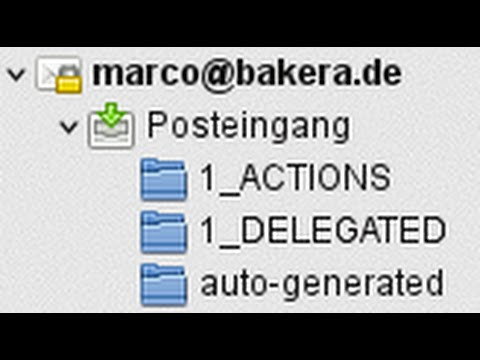

E Mails organisieren
####################
:date: 2014-07-11 17:52
:author: marco.bakera
:tags: Tipp, Video
:tags: E-Mail, GTD
:slug: e-mails-organisieren
:status: published

Jeder kennt das Problem: Irgendwann sammeln sich die E-Mails im Postfach
und man verliert den Überblick. Am besten ist es daher, wenn man ein
System hat, nach dem man die E-Mails organisieren und anschließend
abarbeiten kann. Ich stelle euch mein System vor, das ich schon seit
vielen Jahren erfolgreich einsetze.

