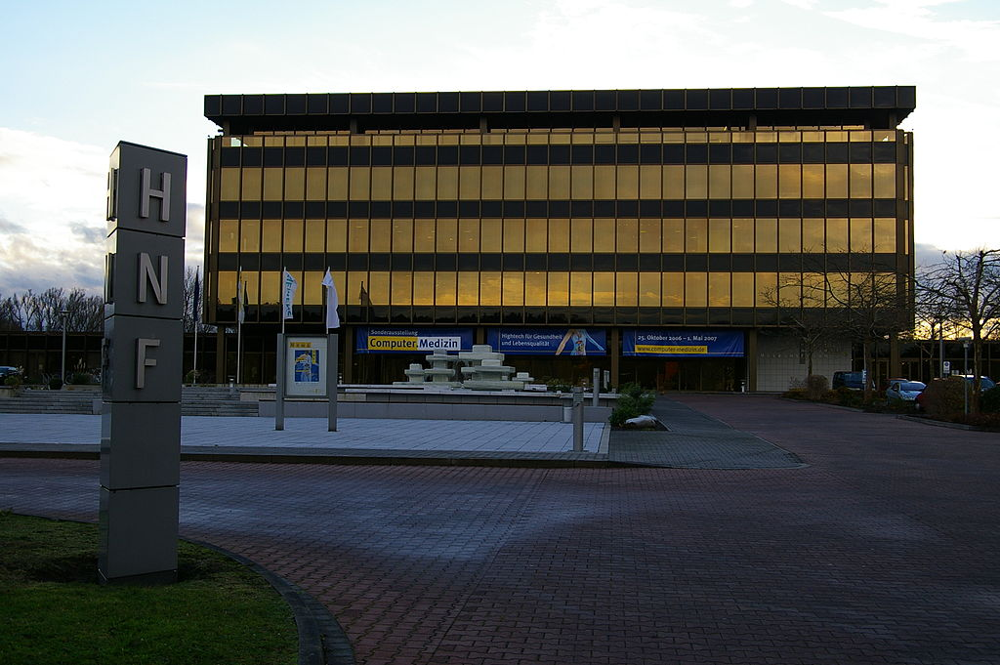
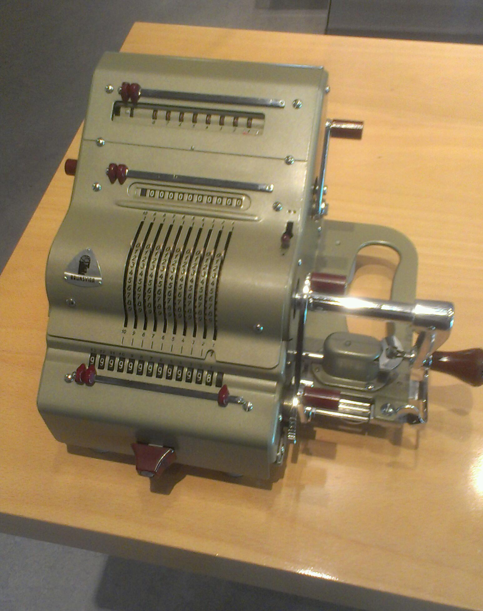
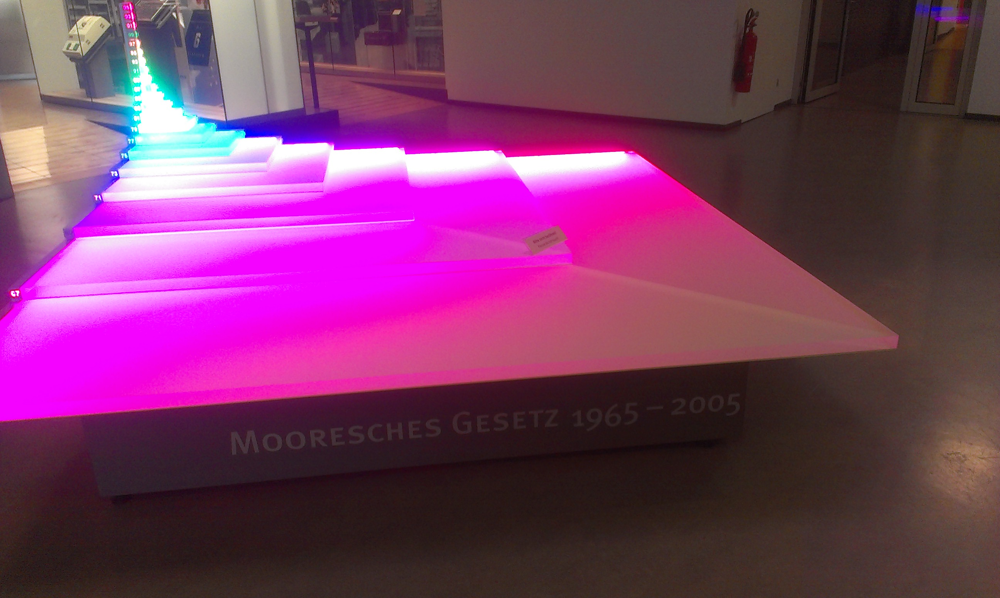
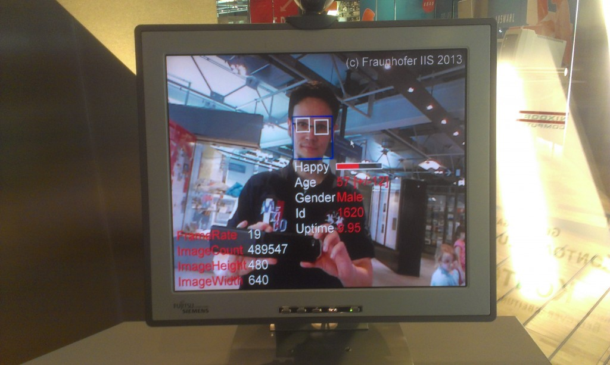
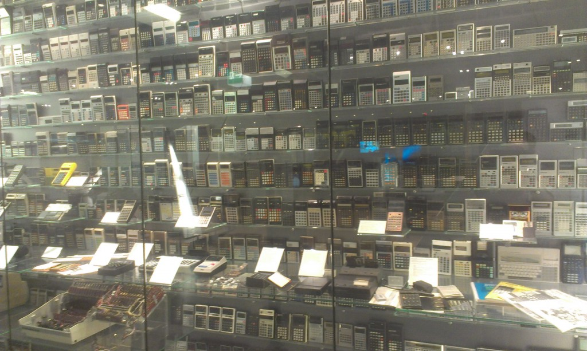

Ein Besuch im größten Computermuseum der Welt
#############################################
:date: 2014-04-27 12:59
:author: marco.bakera
:tags: Bildung, Mathe, Tipp, Wissenschaft, Ausflug, Computer, HNF, Museum, Paderborn
:slug: ein-besuch-im-groessten-computermuseum-der-welt
:status: published

|Foto von Johann H. Addicks - addicks@gmx.net (Lizenz Creative Commons BY-NC-ND
3.0)| 

Foto von Johann H. Addicks unter einer `Creative Commons
Lizenz <http://creativecommons.org/licenses/by-nc-nd/3.0/>`__.

Ich hatte es mir schon lange vorgenommen: Irgendwann wollte ich mir das
größte Computermuseum der Welt einmal anschauen. Es geht um das `Heinz
Nixdorf MuseumsForum <http://www.hnf.de/>`__ in Paderborn. Nach einer
Stunde Fahrt stand ich also auf einem Platz mit einem weißen Brunnen,
dessen glasklares Wasser mich in Empfang nahm. Ich ging hinein und
schaute mir die Ausstellung an.

In der ersten Etage wird ein weiter Bogen gespannt. Es dreht sich
thematisch alles um die vor-elektronische Zeit von der Keilschrift bis
in die 1950er Jahre. Hier lerne ich die Rechenmaschine
`Brunsviga <https://de.wikipedia.org/wiki/Brunsviga>`__ kennen.

|Brunsviga - Ein Tischrechner mit Walzenbetrieb aus
Braunschweig..| 

Brunsviga - Ein Tischrechner mit Walzenbetrieb aus
Braunschweig..

Es ist eine mechanische Rechenmaschine, die die vier Grundrechenarten
Plus, Minus, Mal und Geteilt beherrscht. Mit den Hebeln in der Mitte
kann man eine Zahl einstellen. Diese wird in das Ergebnisregister unten
übertragen, wenn man an der großen Kurbel auf der rechten Seite dreht.
Ich höre, wie die Zahnräder im Inneren der Maschine ineinander greifen
und spüre, dass die Maschine etwas macht. Ich lerne auch, wie man die
anderen Grundrechenarten Minus, Mal und Geteilt durchführen kann. Die
Maschine macht mir viel Spaß und so schaue ich nachher sogar einmal bei
Ebay nach, wie teuer ein solches Ding für die eigenen vier Wände wäre.

Die zweite Etage widmet sich der Revolution, die mit Einführung von
Transistoren folgen sollte. Es gibt viel zu sehen, auszuprobieren,
anzuhören und durchzulesen. Manchmal habe ich ein schlechtes Gefühlt,
nicht jede Infotafel vollständig gelesen zu haben - dafür sind es
einfach zu viele.

Ich lerne auch das
`Mooresche-Gesetz <https://de.wikipedia.org/wiki/Mooresches_Gesetz>`__
kennen - naja, eigentlich kannte ich es schon aus meinem Studium. Aber
die raumgreifende Visualisierung lässt mich doch einem Moment verharren.

|Das Mooresche Gesetz - Endlich habe ich es leibhaftig vor mir gesehen.| 

Und so ist es mit zahlreichen Dingen, die ich im Museum sehe. Vieles ist
mir bereits bekannt - entweder habe ich darüber gelesen, ein Bild davon
gesehen oder auch nur davon gehört. Hier kann ich die Dinge jedoch
anfassen, mit ihnen spielen oder interagieren. Sie werden lebendig und
im realen Sinne "begreifbar".

So weiß ich natürlich auch, dass man aus einem Videobild viele
Informationen extrahieren kann. Als ich dann jedoch vor einer
Bilderkennungssoftware stehe und sie mir den Grad meiner Fröhlichkeit,
mein Geschlecht und mein geschätztes Alter anzeigt, wird mir schon ein
wenig mulmig. Beim Alter lag die Software auf jeden Fall beleidigend
daneben.

|Bilderkennung|

Das Museum hat wirklich viel zu bieten. Sogar so viel, dass ich an
dieser Stelle niemals umfassend darüber berichten könnte. Es gibt
Exponate zu mechanischen Rechenmaschinen, zu Lochkartenrechnern, zur
Algorithmik, zum Aufbau eines Computers, zur Kryptographie, zu wichtigen
Personen und Ereignissen und so weiter und so weiter. Nach 3,5 Stunden
komme ich am Ende an und habe trotzdem das Gefühl, an vielen Stellen nur
oberflächlich drauf geschaut zu haben. Das ist jedoch ein gutes Zeichen,
denke ich mir. Es ist wie bei einem Film, bei dem man weiß, nicht alles
verstanden zu haben, wenn der Abspann läuft. Irgendwann werde ich also
wiederkommen und mich darauf freuen, wieder etwas Neues zu entdecken und
etwas mehr aus meinem Fachbereich zu "begreifen".

Ich freue mich schon auf den nächsten Besuch - dann werde ich mir auch
die Taschenrechnerwand noch einmal etwas genauer ansehen.

|Die Taschnrechnerwand|

.. raw:: html

   <dl class="wp-caption alignnone" id="attachment_963" style="width: 1556px;">
   <dt class="wp-caption-dt">
   </dt>
   </dl>

