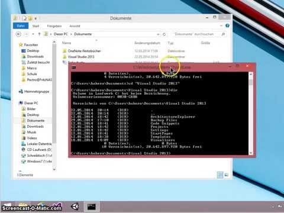

Eingabeaufforderung aus dem Explorer starten 
#############################################
:date: 2014-07-03 13:59
:author: marco.bakera
:tags: Video
:slug: eingabeaufforderung-aus-dem-explorer-starten
:status: published

Auch unter Windows brauche ich immer mal wieder ein Konsolenfenster - in
der Windowssprache umständlich als Eingabeaufforderung bezeichnet. Damit
ich mit der Eingabeaufforderung auch direkt an der richtigen Stelle bin,
zeige ich in diesem Video, wie man das Fenster aus dem Datei-Explorer
heraus startet.

