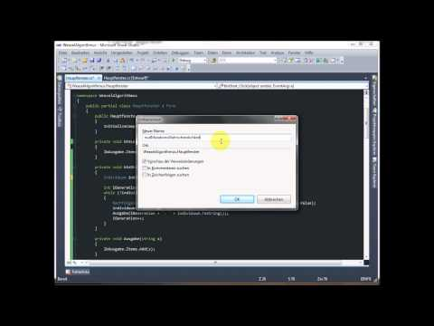

Genetische Programmierung: Der Weasel-Algorithmus
#################################################
:date: 2013-05-31 14:00
:author: marco.bakera
:tags: Bildung, Programmierung, Video
:slug: genetische-programmierung-der-weasel-algorithmus
:status: published

Der
`Weasel-Algorithmus <http://www.bakera.de/dokuwiki/doku.php/schule/weasel-algorithmus>`__
ist ein genetischer Algorithmus, der durch Mutation und Selektion ein
gewünschtes Ziel schrittweise annähert. In dem Video erstelle ich eine
Anwendung, die das Prinzip des Algorithmus verdeutlicht.

Der Algorithmus funktioniert so:

#. Denke dir eine zufällige Zeichenkette aus.
#. Verändere zufällig einige Buchstaben darin und generiere dadurch neue
   Zeichenketten.
#. Von diesen neuen Zeichenketten nehme ich die Zeichenkette, die am
   besten zu meinem Ziel passt - z.B. diejenige, in der am meisten
   Buchstaben schon am richtigen Platz sind.
#. Mit dieser neuen Zeichenketten fahre ich wie bei Schritt 2 fort. Das
   passiert so lange, bis die gewünschte Zeichenkette entsteht.

Wir können und einen Haufen Affen vorstellen. Jeder Affe hat eine
Schreibmaschine, auf die er einhämmert. Wenn wir nur lange genug warten,
entstehen zufällig irgendwann die gesammelten Werke von Shakespeare. Das
nennt man übrigens das
`Infinite-Monkey-Theorem <http://de.wikipedia.org/wiki/Infinite-Monkey-Theorem>`__.

Das Video zeigt ungeschnitten, wie ich den Algorithmus programmiert
habe. Deshalb ist es mit 42 Minuten diesmal etwas länger geworden. Dafür
sieht man aber auch jeden Fehler, den ich gemacht und jede Entscheidung,
die ich während der Arbeit getroffen habe.

