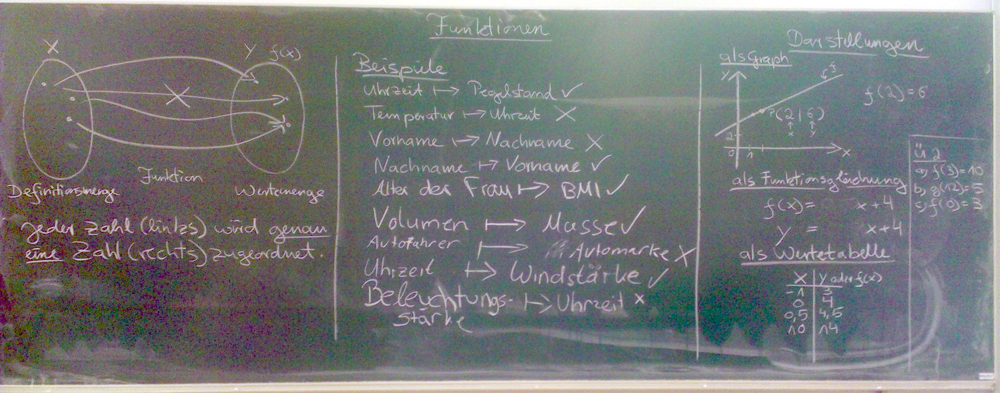

Gestern ging es in Mathematik um Funktionen
###########################################
:date: 2013-10-02 16:08
:author: marco.bakera
:tags: Mathe
:slug: gestern-ging-es-in-mathematik-um-funktionen-oer-tafelbild
:status: published

|Funktionen|

Was sind eigentlich Funktionen und wie können wir sie darstellen und mit
ihnen arbeiten? Ich wurde gestern durch einige kreative Ideen
überrascht.

