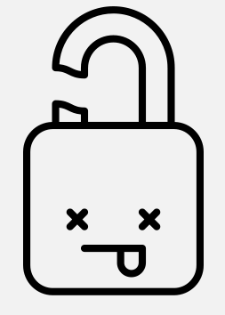

Ich wurde gehackt
#################
:date: 2014-06-17 19:34
:author: marco.bakera
:tags: Tipp
:slug: ich-wurde-gehackt
:status: published

|cc: Julien Deveaux| 

cc: Julien Deveaux

28. März 2014: Am Montag erhielt ich eine E-Mail von Apple, mit der
bitteren Information dass meine Apple-ID und E-Mail-Adresse geändert
wurden. Natürlich geschah dies ohne mein Zutun. Beim Versuch mich erneut
anzumelden, ging erstmal nichts. Auch ein Passwort, dass ich mir erneut
an meine E-Mail-Adresse habe schicken lassen, wollte nicht eintreffen.

Nun dachte ich mir: Was nun? Was ist Plan B?

Die zweite Möglichkeit, mich einzuloggen, geht über die Beantwortung
einiger Fragen zu meinem Haustier und meinen Lieblingssportverein. Da
man solche Fragen recht schnell mit etwas Social-Engineering
herausbekommen kann, gebe ich dort meist irgendwelchen Unsinn ein. Nach
einigen weiteren erfolglosen Versuchen, sah es so aus als wäre das Konto
gesperrt. Gut so, dann kann zumindest kein Schindluder damit getrieben
werden.

Dem war leider nicht so.

Einen Tag später erhielt ich eine E-Mail mit der Information, dass ein
Spiel über meine ID mit einer seltsamen Adresse von Yahoo gekauft worden
war. Nun hat es mir gereicht und ich habe die Apple-Hotline angerufen.
Wenige Minuten später hatte ich einen freundlichen Menschen in einer
verdammt schlechten Tonqualität am Rohr. Der wollte auch wissen, was
mein Lieblingssportverein oder meine erstes Auto waren. Leider sind wir
uns nicht einig geworden und er konnte mich nicht authentifizieren. Er
würde das Konto und meine Kreditkarte jedoch für weitere Transaktionen
sperren. Das klingt gut und war ganz in meinem Sinne.

Bis jetzt ist mir schleierhaft, wie es zu dem Identitätsdiebstahl kommen
konnte.

Daher mein Ratschlag für mein Ego in der Zukunft: Nutze
Zwei-Faktor-Authentifizierung, wo immer es möglich ist und sichere
Accounts, bei denen deine Bankverbindung liegt, besonders gut ab.

 

