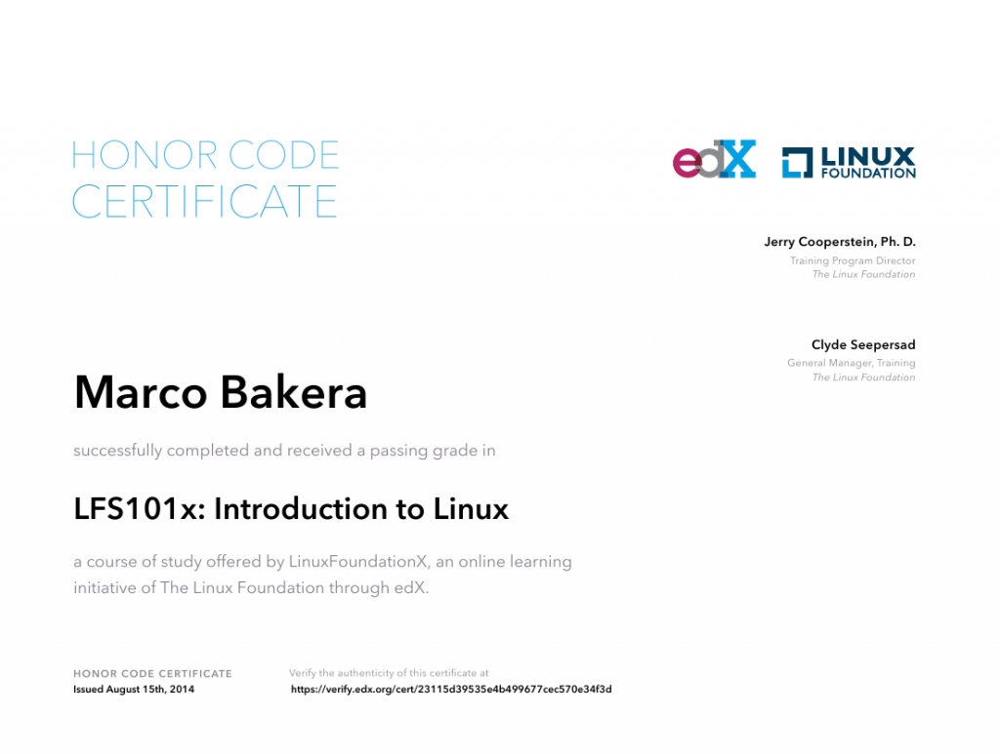

Linux Einsteigerkurs erfolgreich abgeschlossen
##############################################
:date: 2014-08-15 21:09
:author: marco.bakera
:tags: Bildung, Informatik, Linux
:slug: linux-einsteigerkurs-erfolgreich-abgeschlossen
:status: published

|LinuxZertifikat|

Ich habe den kostenlosen
`Linuxkurs <https://www.edx.org/course/linuxfoundationx/linuxfoundationx-lfs101x-introduction-1621>`__
von edX erfolgreich abgeschlossen - ich hatte `im März darüber
berichtet <http://www.bakera.de/wp/2014/03/mit-und-harvard-universitaet-bieten-kostenlosen-linux-kurs-an/>`__.
Die Fragen sind für einen Linuxkenner nicht sonderlich schwierig und ich
hätte mir auch etwas mehr Interaktivität bei den praktischen Teilen
gewünscht. Dennoch wird ein schöner runder Bogen über alle Bereiche der
Linuxlandschaft gezogen. Wer noch einen Nachweis für seine
Bewerbungsmappe sucht, sollte bei dem Zertifikat zuschlagen.

