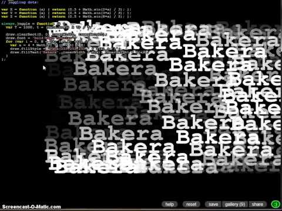

LiveCoding mit Scratch, LiveCoder und Livecodelab
#################################################
:date: 2013-05-11 21:43
:author: admin
:tags: Kunst, Programmierung, Video
:slug: livecoding-mit-scratch-livecoder-und-livecodelab
:status: published

Im zweiten Teil meiner Video-Serie über das
`LiveCoding <http://wiki.bakera.de/doku.php/schule/live_coding>`__ wende
ich mich diesmal drei weiteren Systemen zu: Scratch, LiveCode und
Livecodelab.

Viel Spaß!

| Zum `ersten Teil der
  Live-Coding-Serie <http://pintman.blogspot.de/2013/05/livecoding-mit-fluxus.html>`__.
| Alle wichtigen Links stehen auf meiner Seite im Artikel
  `LiveCoding <http://wiki.bakera.de/doku.php/schule/live_coding>`__.

