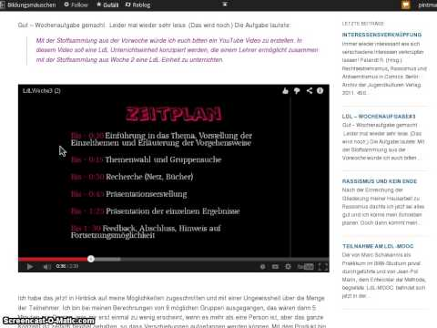

Review einer Unterrichtseinheit von Angelika Mogk zum Thema Comics
##################################################################
:date: 2014-06-03 16:04
:author: marco.bakera
:tags: Bildung, ldl, ldlmooc, mooc
:slug: review-einer-unterrichtseinheit-von-angelika-mogk-zum-thema-comics
:status: published

Beim `derzeit laufenden
ldlmooc <{filename}lernen-durch-lehren-eine-visualisierung.rst>`__
habe ich mich entschlossen, die `Unterrichtseinheit von Angelika
Mogk <http://angelikamogk.wordpress.com/2014/05/29/ldl-wochenaufgabe3/>`__
zu begutachten.

