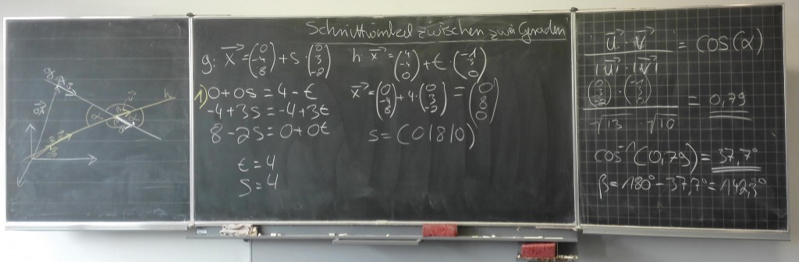

Schnittwinkel zwischen zwei Geraden
###################################
:date: 2015-02-15 09:44
:author: marco.bakera
:tags: Bildung, Mathe, ldl, Tafelbild, Vektorrechnung
:slug: schnittwinkel-zwischen-zwei-geraden
:status: published

|SchnittwinkelGeraden|

Meine Schüler zeigen im Mathematikunterricht, wie man mit Hilfe der
Vektorrechnung den Schnittwinkel zwischen zwei Geraden berechnet. In der
Darstellung noch etwas chaotisch - aber das wird noch.

