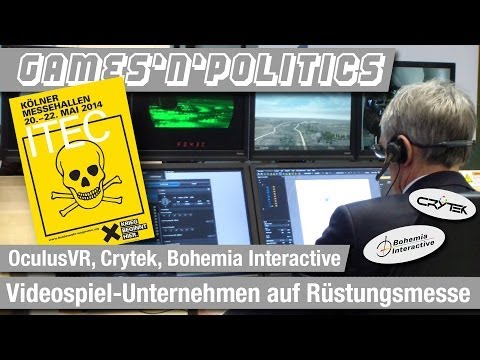

Spielehersteller kooperieren mit der Rüstungsindustrie
######################################################
:date: 2014-06-01 11:59
:author: marco.bakera
:tags: Informatik, Video
:slug: spielehersteller-kooperieren-mit-der-ruestungsindustrie
:status: published

Michael Schulze von Glaßer zeigt in seiner Videoreihe Games'n'Politics
in einem Bericht von der Rüstungsmesse ITEC die Verbindung zwischen
Spieleherstellern und der Rüstungsindustrie. Damit wird mal wieder
deutlich, dass Programmierer ihren moralischen Wertekompass immer wieder
neu kalibrieren müssen.

