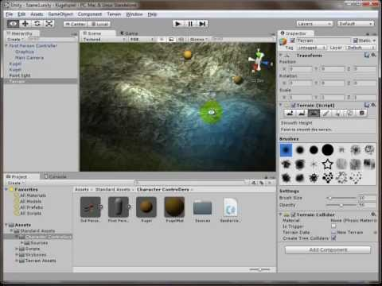

Spieleprogrammierung mit Unity - Teil 2: Farbe kommt ins Spiel
##############################################################
:date: 2013-11-15 19:49
:author: marco.bakera
:tags: Programmierung, Spaß, Spiele
:slug: spieleprogrammierung-mit-unity-teil-2-farbe-kommt-ins-spiel
:status: published

Unser Spiel aus dem `ersten
Teil <{filename}spieleprogrammierung-mit-unity.rst>`__
funktioniert im Prinzip schon, sieht aber noch gar nicht schön aus.
Daher werden wir im nächsten Teil etwas Farbe und Texturen in die Hand
nehmen und die Landschaft anschaulich gestalten. Außerdem kümmern wir
uns darum, dass die Kugeln sich auch bewegen und wie echte physikalische
Objekte verhalten.

`Alle Videos im
Wiki <http://bakera.de/dokuwiki/doku.php/schule/unity>`__

