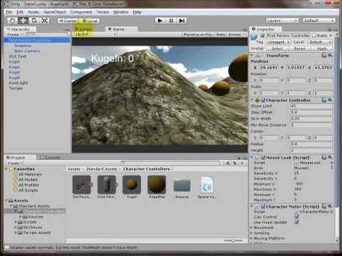

Spieleprogrammierung mit Unity - Teil 3: GUI-Anzeige
####################################################
:date: 2013-12-14 12:43
:author: marco.bakera
:tags: Bildung, Programmierung, Video
:slug: spieleprogrammierung-mit-unity-teil-3-gui-anzeige
:status: published

Heute geht es in Teil 3 der Reihe `Spieleprogrammierung mit
Unity <http://bakera.de/dokuwiki/doku.php/schule/unity>`__ um die
Anzeige auf dem Bildschirm.

Damit wir wissen, wie viele Kugeln wir schon eingesammelt haben und wie
viele Kugeln noch fehlen, bringen wir nun eine Anzeige ins Spiel. Diese
Anzeige blendet oben links die Anzahl der eingesammelten Kugeln ein.

