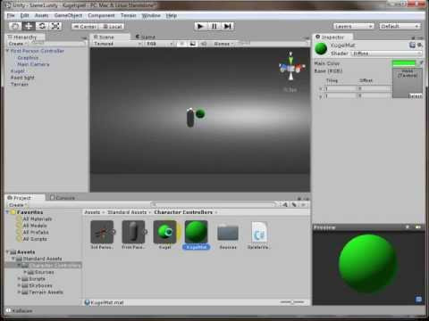

Spieleprogrammierung mit Unity
##############################
:date: 2013-11-13 14:44
:author: marco.bakera
:tags: Programmierung, Spiele
:slug: spieleprogrammierung-mit-unity
:status: published

`Unity <http://www.unity3d.com>`__ ist eine Programmierumgebung mit der
du leicht Spiele erstellen kannst. 3D-Objekte werden in einer Szene
arrangiert und die Interaktion zwischen den Objekten wird mit Skripten
in C# oder Javascript programmiert.

In den folgenden Videos zeige ich dir, wie du mit Unity ein kleines
Spiel erstellen kannst. Bei dem Spiel müssen Kugeln eingesammelt werden,
die auf einer Hügelebene herumkullern.

In Teil 1 erstellen wir ein Projekt und den Charakter, mit dem wir die
Spielwelt erkunden wollen. Beim Kontakt des Spielers mit einer Kugel,
wird die Kugel aus dem Spiel entfernt.

`Artikel in meinem
Wiki <http://bakera.de/dokuwiki/doku.php/schule/unity>`__

