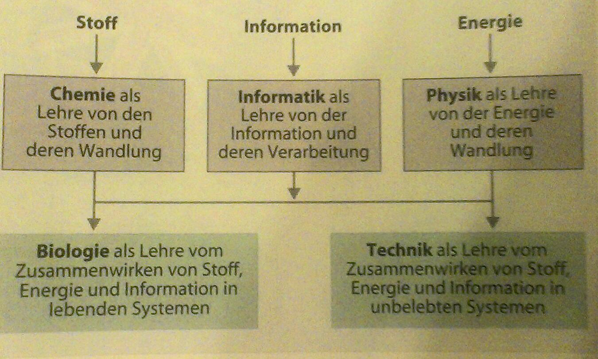

Stoff, Information, Energie - Ein Weltmodell
############################################
:date: 2014-06-23 13:06
:author: marco.bakera
:tags: Bildung, Informatik, Kunst, Video, Wissenschaft
:slug: stoff-information-energie-ein-weltmodell
:status: published

|Norbert Beier: Informatik und die klassischen Naturwissenschaften (MNU Heft 3,
2006)| 

Norbert Beier: Informatik und die klassischen Naturwissenschaften
(MNU Heft 3, 2006)

Die aktuelle c't 14/2014 stellt in einem
`Artikel <http://www.heise.de/ct/inhalt/2014/14/100/>`__ ein Modell der
Welt vor, das mir sehr gut gefallen hat. Es bringt die
wissenschaftlichen Disziplinen Physik, Chemie und Informatik in einem
Schaubild treffend zusammen und stellt sie in einen Sinnzusammenhang mit
den beiden Bereichen Biologie und Technik.

Cristóbal Vila erweitert dieses Bild um Konzepte der Inspiration,
Ästhetik und Sinnlichkeit. In seinem Video
`INSPIRATIONS <http://www.etereaestudios.com/docs_html/inspirations_htm/intro.htm>`__
fasst er unterschiedliche Quellen für Erklärungsmodelle wissenschaftlich
mathematischer Phänomene zusammen in einem Kameraflug durch die Kemenate
der jüngeren Wissenschaftsgeschichte.

`Video <https://player.vimeo.com/video/36296951>`_

