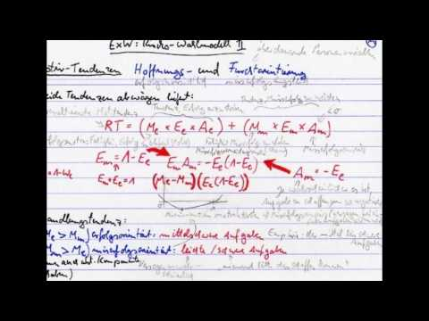

Theorien der Motivations- und Emotionspsychologie - ein Rückblick
#################################################################
:date: 2015-09-20 12:36
:author: marco.bakera
:tags: Bildung, Gesellschaft, Video
:tags: Psychologie
:slug: theorien-der-motivations-und-emotionspsychologie-ein-rueckblick
:status: published

Vor einiger/langer Zeit habe ich Informatik an der Uni
Dortmund (heute TU Dortmund) studiert. Damals konnte man dieses Fach
noch auf Diplom studieren. Dazu brauchte man auch ein Nebenfach -
sozusagen ein Anwendungsgebiet der Informatik. Ich hatte mich damals für
Psychologie entschieden. Es erschien mir ein guter Ausgleich zum sehr
technischen und mathematischen Fach Informatik. Damit bin ich auch ganz
gut gefahren. Konnte ich doch in viele spannende Seminare reinschauen,
während sich das Informatikstudium hauptsächlich auf die weniger
interaktiven und wenig kommunikativen Vorlesungen konzentrierte.

In dieser Zeit musste ich diverse Prüfungen ablegen und sogar an
Versuchen teilnehmen, um Versuchspersonenstunden zu sammeln. Für eine
mündliche `Prüfung über Motivations und
Emotionspsychologie <https://www.bakera.de/wp/2005/10/1-0/>`__ hatte ich
mir Karteikarten zum Lernen erstellt und auch eine Erklärung
eingesprochen. Das war im Jahr 2005 - das ist also schon lange her.
Jetzt habe ich das Material einmal zusammengefasst und in zwei Videos
aufgeteilt, die ihr unten sehen könnt.

Mir haben meine Karteikarten damals sehr gut weiter geholfen. Vielleicht
sind sie auch für euch interessant. Spannend bei dem Schnitt war auch,
dass mir mein zehn Jahre jüngeres Ich in diesem Video noch viele
interessante Dinge erzählen konnte, die ich mittlerweile in dieser
Detailtiefe gar nicht mehr wusste. :)

.. image:: images/2018/06/nEfZzPA4sz0.jpg
   :alt: Youtube-Video
   :target: https://www.youtube-nocookie.com/embed/nEfZzPA4sz0?rel=0
