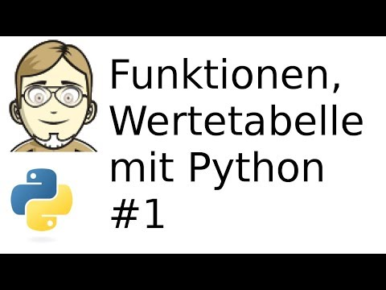
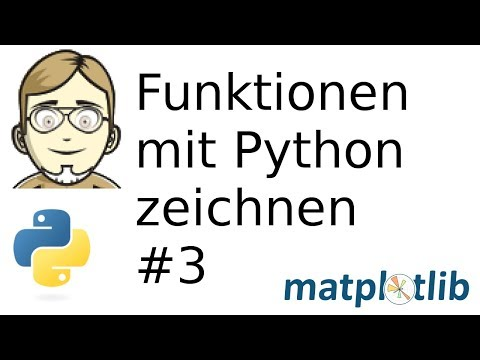
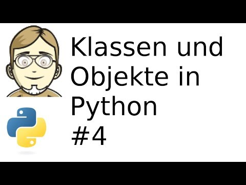
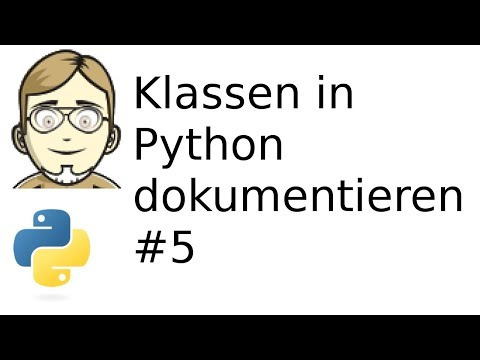
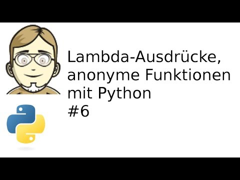
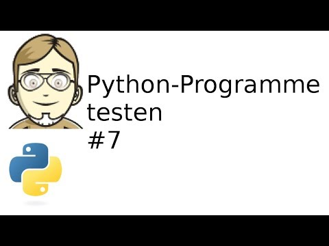

Videoreihe: Mit Python Funktionen zeichnen
##########################################
:date: 2018-06-18 21:00
:author: marco.bakera
:tags: Video, Programmieren, Python
:status: draft

Ich habe mich mal wieder an ein paar Videos versucht, nachdem es auch meinem
YouTube-Kanal etwas ruhiger geworden ist. In dieser Reihe habe ich versucht,
verschiedene grundlegende Aspekte der Python-Programmierung am Beispiel von
mathematischen Funktionen darzustellen.

In einem ersten Video wird eine Wertetabelle mit Hilfe einfacher 
Python-Funktionen gezeichnet.

In nächsten Schritt versuchen wir ein algorithmisches Problem mit einem 
Pythonprogramm zu lösen: die Berechnung der Nullstelle einer Funktion.

.. image:: images/2018/06/fUtne5Zx124.jpg
   :alt: Youtube-Video
   :target: https://www.youtube-nocookie.com/embed/fUtne5Zx124?rel=0

Schließlich wird die Funktion mit der Pythonbibliothek ``matplotlib`` 
gezeichnet. Wir schauen uns auch das wichtige Konstrukt der 
"list comprehension" an.

Nach den ersten Versuchen mit Funktionen, kann die Implementierung jetzt
in eine objekt-orientierte Realisierung mit Klassen und Objekte überführt
werden.

Die Dokumentation von Klassen und Objekte ist wichtig für andere 
Programmierer und auch für einen selbst, wenn man nach längerer Zeit
wieder auf den Quelltext schaut.

Unter dem Begriff Lambda-Ausdruck lassen sich anonyme Funktionen, 
also Funktionen oder Methoden ohne einen Namen, zusammenfassend
beschreiben.

Schön, wenn das Programm das tut, das es soll. Damit dies auch in Zukunft
so bleibt, können Programme automatisch getestet werden.

Nicht immer müssen Parameter bei einem Aufruf übergeben werden. Man
kann auch Default-Werte angeben, die verwendet werden, wenn kein
Parameter eim Aufruf angegeben wurde.

.. image:: images/2018/06/c8ih2nW-SCI.jpg
   :alt: Youtube-Video
   :target: https://www.youtube-nocookie.com/embed/c8ih2nW-SCI?rel=0
