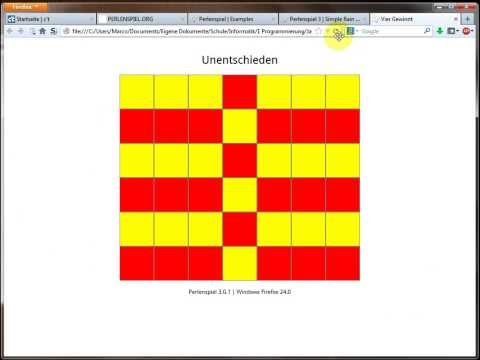

Vier Gewinnt mit dem Perlenspiel-Framework programmieren
########################################################
:date: 2013-10-28 16:53
:author: marco.bakera
:tags: Bildung, JavaScript, Programmierung, Spiele
:slug: vier-gewinnt-mit-dem-perlenspiel-framework-programmieren-javascript
:status: published

Mit Hilfe des `Perlenspiel-Frameworks <http://perlenspiel.org/>`__
lassen sich einfach Spiele in Javascript programmieren. Im folgenden
Video zeige ich, wie man den Klassiker "Vier Gewinnt" damit umsetzen
kann. `In meinem
Wiki <http://bakera.de/dokuwiki/doku.php/schule/perlenspiel>`__ findet
ihr den vollständigen Quelltext zu diesem Spiel.

