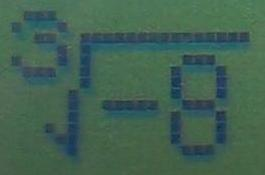
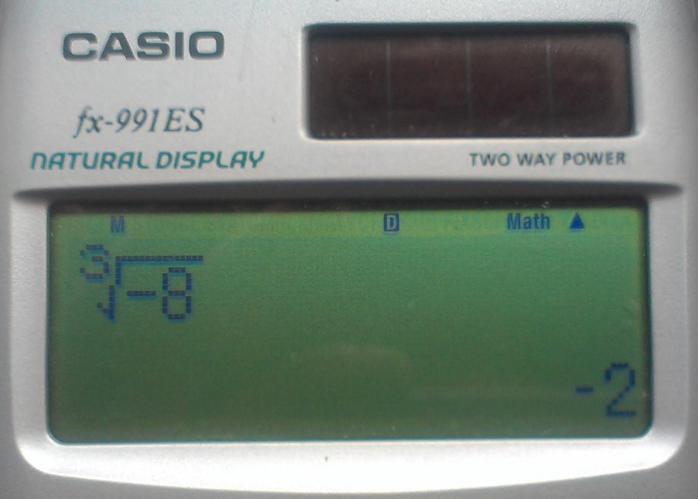
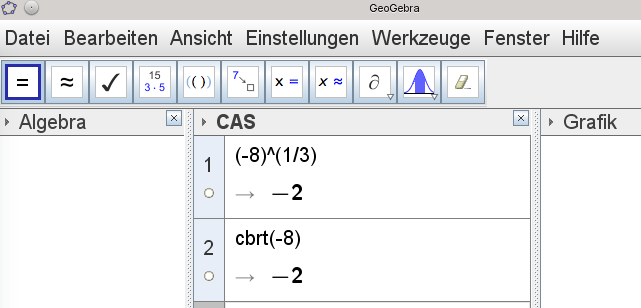
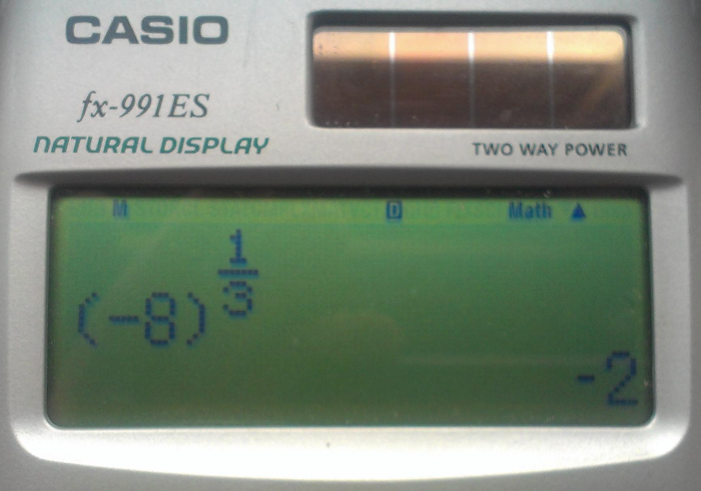
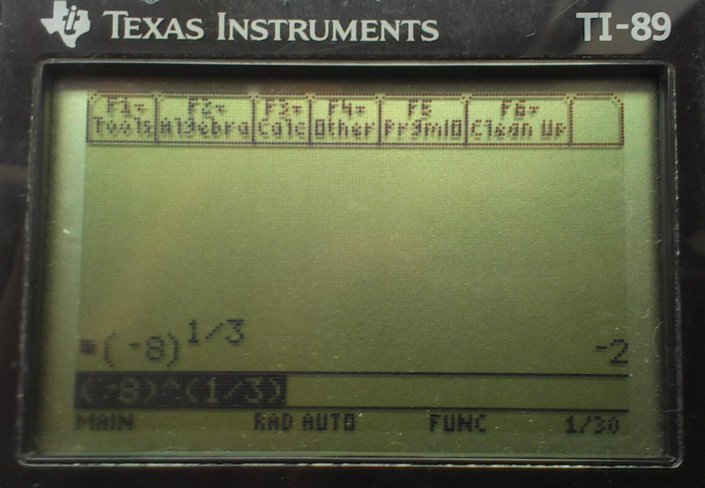
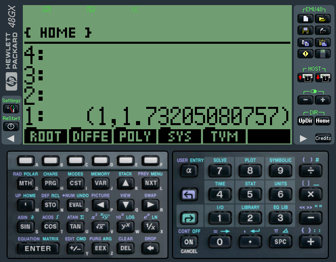
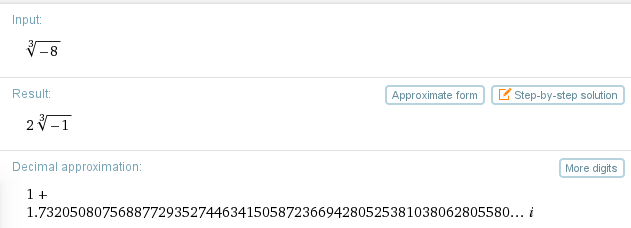
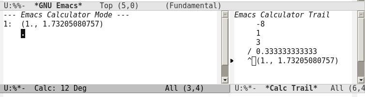
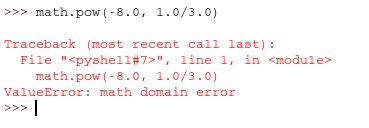

Welchen Wert hat ∛(-8) ?
########################
:date: 2014-06-16 14:52
:author: marco.bakera
:tags: Mathe
:tags: Taschenrechner
:slug: welchen-wert-hat-dritte-wurzel-8
:status: published

|DritteWurzelMinusAcht|\ Mit der Quadratwurzel (geschrieben √ )kennen
wir uns eigentlich ganz gut aus. So lautet die Wurzel aus 4 eben 2. Denn
2 zum Quadrat ergibt wieder die 4.

√4 = 2

Insbesondere gilt aber nicht √4 = -2 - denn mit dem Wurzelzeichen wird
immer der positive Betrag berechnet. Wie sieht es aber mit der dritten
Wurzel aus? Also z.B. die dritte Wurzel aus 8: ∛8 Wir suchen eine Zahl,
die wir dreimal mit sich selbst malnehmen können und die dann 8 ergibt.
Nach einigen Überlegungen kommen wir auf die 2.

∛8 = 2, denn 2 \* 2 \* 2 = 8

Jetzt wird es spannend. Wir betrachten nun negative Zahlen, aus denen
wir die Wurzel ziehen wollen. Für Quadratzahlen wird sehr schnell klar,
dass das nicht klappen kann - denn welchen Wert sollte etwa √(-4) haben?
Wir würden eine Zahl benötigen, die mit sich selbst malgenommen -4
ergibt. Das klappt für keine Zahl. Entweder ist die Zahl positiv und sie
bleibt beim Quadrieren positiv oder sie ist negativ und wird beim
Quadrieren positiv.

Aber wie sieht es mit der dritten Wurzel aus? Die dritte Wurzel aus -8
also ∛(-8) könnte -2 ergeben.

∛(-8) = -2, denn (-2) \* (-2) \* (-2) = -8

Tatsächlich gibt es auch Taschenrechner, die genau das herausbekommen.
So etwa unser Schulrechner von Casio und das Mathematikprogramm
GeoGebra.

|WurzelNegativ-Casiofx-991ES-1| |WurzelNegativ-Geogebra|

Geogebra berechnet mit cbrt die dritte Wurzel (cube root). Es gibt aber
auch noch eine andere Notation für Wurzeln, die wir hier sehen können:

::

         ⅓
    (-8)

Wir können Brüche als Hochzahlen verwenden und damit Wurzeln
beschreiben. Der Casio kommt in diesem Fall auf genau dasselbe Ergebnis.

|WurzelNegativ-Casiofx-991ES-2|

Auch ein TI-89 kommt zu demselben Ergebnis.

|WurzelNegativ-TI-89|

Soweit so gut. Und eigentlich wäre alles gar nicht so spektakulär, wenn
es eben nicht auch andere Ergebnisse von anderen Rechnern gäbe. So kommt
z.B. das Urgestein der Taschenrechner, der HP48, auf ein Ergebnis mit
einer komplexen Zahl, wenn er (-8)^⅓ rechnet, aber auf 2, wenn er die
dritte Wurzel aus -8 ziehen soll.

|WurzelNegativ-HP48|

Und auch Wolfram-Alpha liefert eine komplexe Zahl als Ergebnis.

|WurzelNegativ-WolframAlpha|

Auch, wenn ich den Rechner des Texteditors Emacs verwende, liefert
dieser ein komplexes Ergebnis. Auf der rechten Seite seht ihr den
Rechenweg.

|WurzelNegativ-Emacs|

Zum Schluss habe ich die Programmiersprache Python mit dem Wert
gefüttert und mir das Ergebnis angeschaut. Python verweigert den Dienst
für negative Zahlen komplett und quittiert mit einem "domain error"

|WurzelNegativ-Python|

Wir sind nun in einer besonders unbefriedigenden Situation. Einerseits
macht das Ergebnis -2 durchaus Sinn. Wie können es nachrechnen und
überprüfen. Aber auch das komplexe Ergebnis 1+1,732i ergibt für die
komplexen Zahlen Sinn. Wir können es auch noch einmal nachrechnen.
Hierbei müssen wir nur beachten, dass i²= -1 ergibt.

∛(-8) = 1+1,732i, denn (1+1,732i) \* (1+1,732i) \* (1+1,732i) = -8

Hier ist die Rechnung für den letzten Schritt:

| (1+1,732i) \* (1+1,732i) \* (1+1,732i) =
| *    Zusammenfassen als Potenz*
| (1+1,732i)² \* (1+1,732i) =
| *    1. Binomische Formel anwenden*
| (1² + 3.464i + 3i²) \* (1+1,732i) =
| *    i² wird durch -1 ersetzt*
| (1 + 3.464i - 3) \* (1+1,732i) =
| *    1 und -3 werden verrechnet*
| (3.464i - 2) \* (1+1,732i) =
| *     Klammern ausmultiplizieren*
| 3.464i + 6i² - 2 - 3.462i =
| *     i² wird wieder durch -1 ersetzt*
| 3.464i - 6 - 2 - 3.462i =
| *     Die beiden Faktoren mit i heben sich gegenseitig auf*
| - 6 - 2 =
| -8

Wir haben für einen mathematischen Ausdruck zwei mögliche Ergebnisse,
die beide plausibel erscheinen. Dennoch ist der Wert -2 problematisch,
weil er sich nicht mit den Potenzgesetzen verträgt. Wir können etwa
folgende Rechnung aufstellen:

| (-8) ^ ⅓ =
| (-8) ^ (1/3) =
| (-8) ^ (2/6) =
| (-8)² ^ (1/6) =
| 64 ^ (1/6) =
| +2

Im letzten Schritt kommt ein positives Ergebnis +2 heraus, also gerade
nicht -2.

Was bleibt uns als Fazit? Sobald negative Zahlen unter der Wurzel
auftauchen, ist höchste Vorsicht geboten. Auch Wikipedia ist sich nicht 
einig, wie mit `Wurzeln aus negativen
Zahlen <https://de.wikipedia.org/wiki/Wurzel_%28Mathematik%29#Wurzeln_aus_negativen_Zahlen>`__
umgegangen werden soll und schlägt zwei alternative Vorgehensweisen vor:

    Wurzeln aus negativen Zahlen sind generell „verboten“...

    Wurzeln aus negativen Zahlen sind erlaubt, wenn der Wurzelexponent
    eine ungerade Zahl... Diese Festlegung ist mit manchen Eigenschaften
    der Wurzeln, die für positive Radikanden gelten, nicht vereinbar.

Vertraue ferner nicht immer auf den Taschenrechner, sondern ziehe auch
andere Überlegungen in Betracht.

